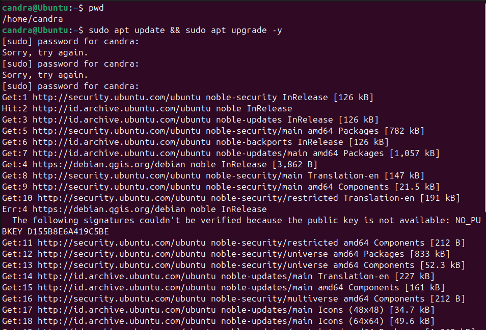
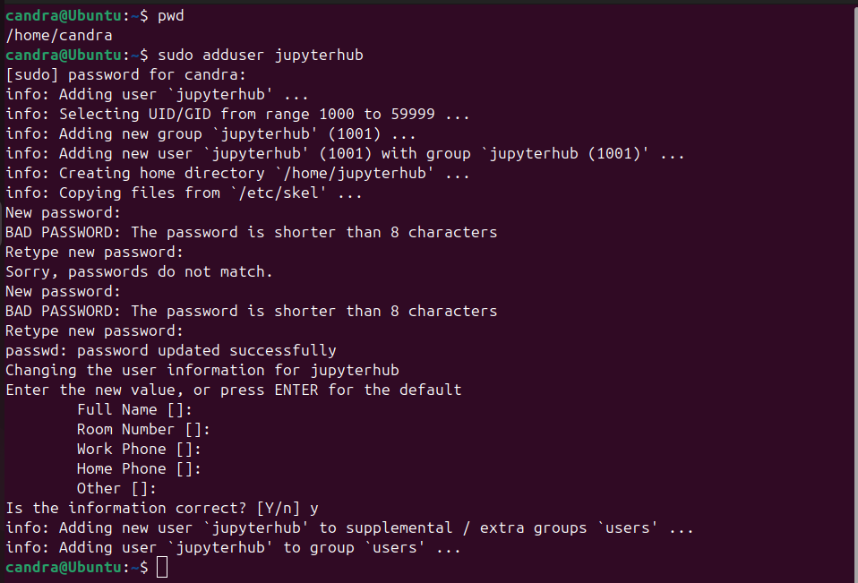
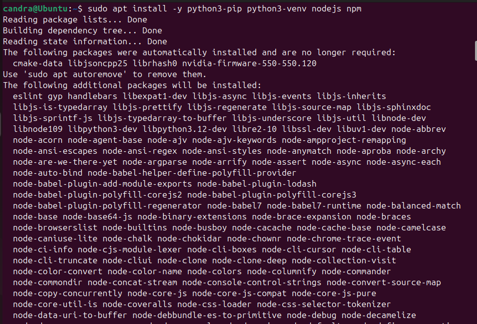
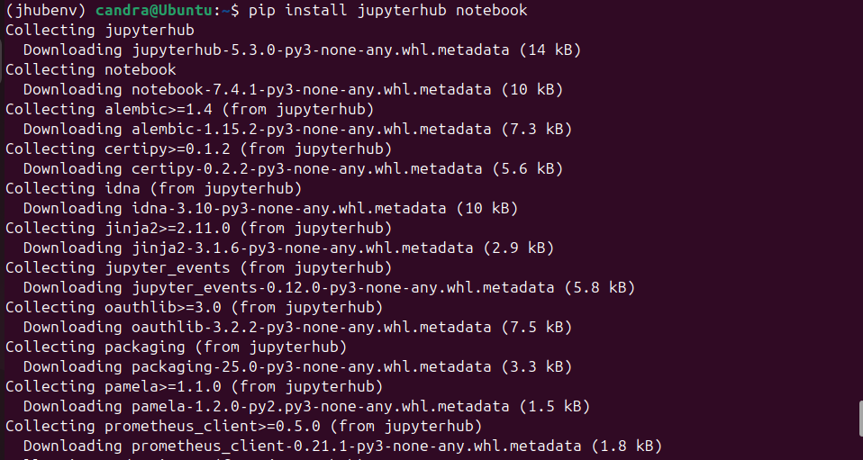
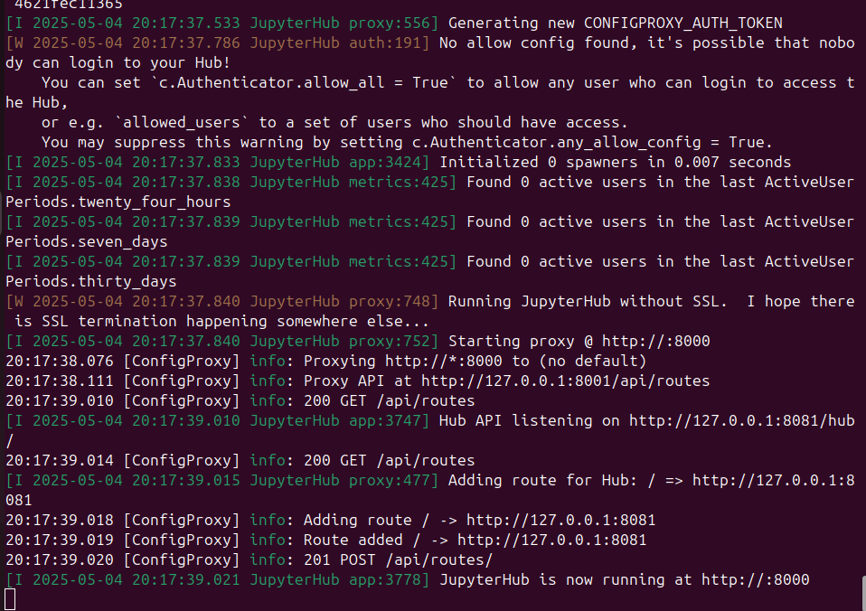
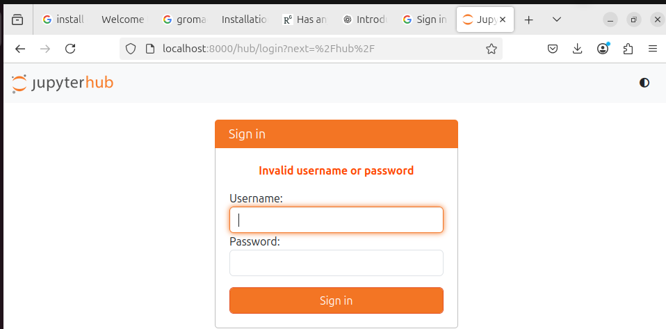

# Panduan Instalasi JupyterHub di Ubuntu 22.04 LTS

Panduan ini berisi langkah-langkah lengkap untuk menginstal **JupyterHub** pada sistem operasi **Ubuntu 24.04 LTS**, termasuk pembuatan environment, instalasi dependensi, dan konfigurasi awal.

---

## 1. Update Sistem (Opsional)

Sebelum menginstal perangkat lunak baru, disarankan untuk memperbarui sistem terlebih dahulu:

```bash
sudo apt update && sudo apt upgrade -y
```



---

## 2. Buat User Baru (Opsional)

Jika tidak ingin menjalankan JupyterHub sebagai root, buat user khusus:

```bash
sudo adduser jupyterhub
```



---

## 3. Instalasi Dependensi

Instal Python, pip, Node.js, dan npm:

```bash
sudo apt install -y python3 python3-pip python3-venv nodejs npm
```



---

Cek versi:

```bash
node -v
npm -v
python3 --version
```


---

## 4. Buat Virtual Environment (Rekomendasi)

```bash
python3 -m venv jhubenv
source jhubenv/bin/activate
```


---

## 5. Instal JupyterHub dan Konfigurasi Proxy

```bash
pip install wheel
pip install jupyterhub notebook
sudo npm install -g configurable-http-proxy
```


---



---


---

## 6. Buat File Konfigurasi

Perintah ini akan membuat file `jupyterhub_config.py`:

```bash
jupyterhub --generate-config
```


---

## 7. Menjalankan JupyterHub

Jalankan server JupyterHub:

```bash
jupyterhub
```



---


Akses melalui browser di:

```
http://localhost:8000
```


Atau jika remote:

```
http://<IP_SERVER>:8000
```



## 📌 Catatan

- Pastikan koneksi internet stabil selama proses instalasi.
- Jalankan sebagai user biasa, bukan root.
- Tutorial ini mengasumsikan kamu sudah familiar dengan penggunaan terminal di Ubuntu.

---


## 📁 File Asli

📄 [`Panduan install Jupyterhub di ubuntu 24.04.docx`](./Panduan%20install%20Jupyterhub%20di%20ubuntu%2024.04.docx)

---

## 🔖 Sumber

Dokumentasi ini disusun berdasarkan pengalaman dan dibantu referensi dari ChatGPT.

